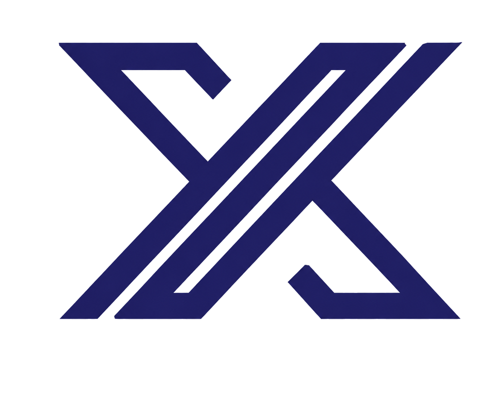

  

# 🎡 Şans Çarkı (Wheel of Fortune) - İnteraktif Çekiliş ve Etkinlik Sistemi

Gelişmiş animasyonlar, gerçek zamanlı bildirimler ve yüksek performanslı modern web teknolojileri ile geliştirilmiş, tamamen interaktif bir "Şans Çarkı" uygulamasıdır. Bu proje, kullanıcı etkileşimini en üst düzeye çıkarmak için tasarlanmış yenilikçi bir arayüze ve akıcı animasyonlara sahiptir.

  <a href="https://cark.yaska.tech/"><strong>🔗 Canlı Demo → cark.yaska.tech</strong></a>

> *Bu depo, projenin mimari vizyonunu ve teknik altyapısını sergilemek amaçlı bir portfolyo sunumudur. Ticari gizlilik ve güvenlik kuralları gereği projenin kaynak kodları paylaşılmamıştır.*

---

## 🌟 Öne Çıkan Özellikler

* **Akıcı Fizik ve Çark Mekaniği:** Gelişmiş SVG manipülasyonu ve momentum tabanlı animasyon algoritmaları sayesinde gerçekçi bir dönüş hissi.
* **Çoklu Çekiliş Yönetimi:** Tek bir sistem üzerinde birbirinden bağımsız üç ayrı çark — **Haftalık**, **Özel** ve **Aylık** çekilişler — her biri kendi ödül havuzu, kodları ve liderlik tablosu ile yönetilir.
* **Gerçek Zamanlı (Real-time) Akış:** Server-Sent Events (SSE) kullanılarak, farklı ekranlarda aynı anda çarkı çeviren kişilerin sonuçları ve liderlik tablosu anlık olarak güncellenir.
* **Canlı Liderlik Tablosu:** Kazananlar ödül değerine göre sıralanır; sahne ekranında isim ve kazanç anlık olarak yansıtılır.
* **Ses Motoru (Audio Engine):** Çarkın her bir dilim geçişinde hıza duyarlı "tick" sesleri; kazanma ve kaybetme durumlarına göre özelleştirilmiş ses efektleri.
* **Kişiselleştirilmiş Katılım (Yetkilendirme):** Kullanıcıların sisteme sadece kendilerine tanımlanmış tek kullanımlık veya çok kullanımlık kodlarla ("KOD GİR" entegrasyonu) girmesini sağlayan güvenli altyapı.
* **Yönetim Paneli (Admin):** JWT tabanlı güvenli girişle; her çekiliş için ödülleri (metin, renk, kazanma olasılığı) düzenleme, kod üretme/iptal etme ve çekiliş geçmişini görüntüleme/temizleme.
* **Responsive (Mobil Uyumlu) Premium Tasarım:** Özel ahşap desenli arka plan, "glassmorphism" efektleri ve mükemmel oranlanmış CSS Grid dizilimleri ile her cihazda (mobil, tablet, masaüstü) kusursuz görünüm.

---

## 💻 Kullanılan Teknolojiler & Mimari

Bu projede sektör standartlarında modern, ölçeklenebilir ve yüksek performanslı bir teknoloji yığını tercih edilmiştir. Sistem, ayrı bir sunucuya ihtiyaç duymadan tamamen **Next.js** üzerinde uçtan uca (full-stack) çalışacak şekilde tasarlanmıştır.

### Frontend (Kullanıcı Arayüzü)
* **[Next.js](https://nextjs.org/) (v16):** React tabanlı güçlü yapısı ve Server API yetenekleri için kullanıldı. Yüksek hızlı sayfa geçişleri ve optimize edilmiş yükleme süreleri sağlar.
* **[React](https://react.dev/) (v19):** Modern, bileşen (component) tabanlı UI inşası.
* **[Tailwind CSS](https://tailwindcss.com/) (v4):** Sınıf bazlı (utility-first) şekillendirme, karmaşık mobil grid düzenleri ve duyarlı (responsive) tasarım yönetimi.
* **[Framer Motion](https://www.framer.com/motion/) (Motion v12):** Modal girişleri, kutlama (confetti) efektleri ve UI mikro-etkileşimlerinin pürüzsüz SVG animasyonları.
* **[Lucide React](https://lucide.dev/):** Hafif, keskin ve modern ikon seti entegrasyonu.

### Backend & Sistem Altyapısı
* **Next.js API Routes:** Çark mantığının doğrulanması, hile koruması ve kod validasyonu gibi işlemler için Node.js tabanlı güvenli sunucu (server-side) kontrolleri. Ödül seçimi ve kod kullanımı sunucu tarafında, atomik veritabanı işlemleri (transaction) içinde yapılır.
* **[PostgreSQL](https://www.postgresql.org/) + [Prisma ORM](https://www.prisma.io/):** Ödüller, kodlar, kullanım kayıtları ve çekiliş geçmişi; tip güvenli Prisma şeması ve migration'lar ile yönetilen ilişkisel bir PostgreSQL veritabanında saklanır.
* **JWT ile Kimlik Doğrulama:** Yönetim paneli erişimi, `bcrypt` ile hash'lenmiş parolalar ve imzalı JWT oturum jetonları ile korunur.
* **Server-Sent Events (SSE):** Soket (WebSocket) bağlantılarına kıyasla daha hafif olan bu yöntem ile anlık (canlı) çekiliş bildirimleri frontend'e stream edilir.

---

## 🎨 Tasarım ve Arayüz Detayları

Arayüz tamamen kullanıcı etkileşimi (engagement) hedeflenerek tasarlandı:
- Alt çubukta bulunan mobil uyumlu özel **ızgara (grid)** mimarisi, kullanıcıların devasa "ÇEVİR" butonunu ve "KOD GİR" akışını rahatça kullanmasını sağlar.
- Renk paleti; ahşap sıcaklığı ve lüks altın/bakır detaylar etrafında şekillendirilmiş olup, gölgelendirmelerle (box-shadow) derinlik katılmıştır.
- Çark, ödül havuzuna göre dinamik olarak yeniden çizilir: tek bir ödül tüm çarkı kaplar, havuz boş olduğunda ise sade siyah bir disk olarak görüntülenir.
- Kutlama (Confetti) kanvası, ödül kazanıldığında fizik kurallarına uygun görsel bir parti başlatır.

---
*Geliştirici: [Emre Can GÜNAL](https://github.com/emregunal)*
